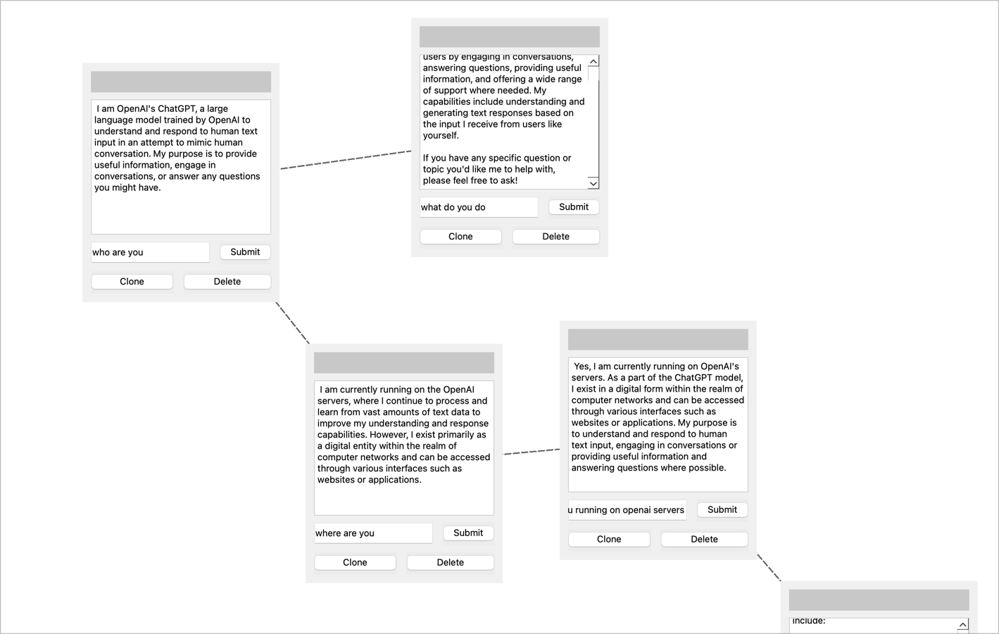
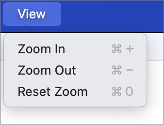
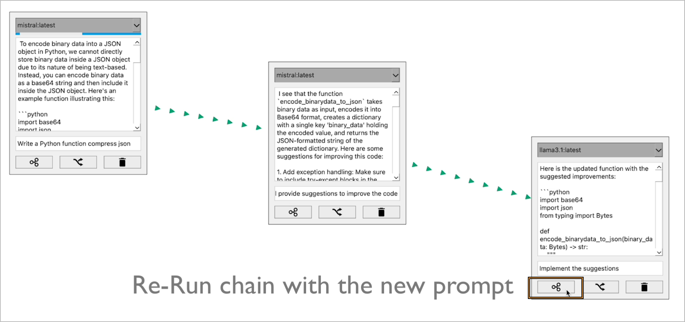

# Chat Circuit



**Brief overview**

<blockquote class="twitter-tweet" data-media-max-width="560"><p lang="en" dir="ltr">🔍 Added a small feature to zoom in using mouse selection. Handy for looking at deep branches #ChatCircuit<br><br>👉 <a href="https://twitter.com/namuan_twt/status/1826620308507558383?ref_src=twsrc%5Etfw">August 22, 2024</a></blockquote>

### Short demos

**Re-run all nodes in a branch**
<blockquote class="twitter-tweet" data-media-max-width="560"><p lang="en" dir="ltr">Chat Circuit now makes it possible to re-run a branch of your conversation with LLM with a different prompt. It supports all local LLMs running on @ollama <br>💾 👉 <a href="https://twitter.com/namuan_twt/status/1820796082248458377?ref_src=twsrc%5Etfw">August 6, 2024</a></blockquote>

**Generate Follow up questions**
<blockquote class="twitter-tweet" data-media-max-width="560"><p lang="en" dir="ltr">Implemented this idea in chat circuit. Here is a quick demo of the application along with generating follow up questions using #LLM <a href="https://twitter.com/namuan_twt/status/1825849039348289574?ref_src=twsrc%5Etfw">August 20, 2024</a></blockquote>

**Zoom in/out**
<blockquote class="twitter-tweet" data-media-max-width="560"><p lang="en" dir="ltr">🔍 Added a small feature to zoom in using mouse selection. Handy for looking at deep branches #ChatCircuit<br><br>👉 <a href="https://twitter.com/namuan_twt/status/1826620308507558383?ref_src=twsrc%5Etfw">August 22, 2024</a></blockquote>

**Minimap Support**

<blockquote class="twitter-tweet" data-media-max-width="560"><p lang="en" dir="ltr">#ChatCircuit Added a mini-map with the help of Sonnet 3.5 in @poe_platform. <br><br>Would have taken me days if not weeks to do it without any help. 🙏<br><br>~ 99% of code is written by Claude <a href="https://twitter.com/namuan_twt/status/1838913082510225442?ref_src=twsrc%5Etfw">September 25, 2024</a></blockquote>

**Export to JSON Canvas Document**

<blockquote class="twitter-tweet" data-media-max-width="560"><p lang="en" dir="ltr">Added option to export to #JSON Canvas document that can be imported by any supported application like @obsdmd / @KinopioClub<br><br>👉 <a href="https://twitter.com/namuan_twt/status/1839415117353570323?ref_src=twsrc%5Etfw">September 26, 2024</a></blockquote>

### Features

**Multi-Branch Conversations**
Create and manage multiple conversation branches seamlessly.

**Contextual Forking**
Fork conversation branches with accurate context retention.

### Editor Features

**Save and Load Diagrams**

**Undo and Redo**

**Zoom and Pan**



**Re-run nodes in a branch**

It is possible to re-run all the nodes in a branch after changing the prompt it any node in the list.



### Running the Application

To run this application, follow these steps:

**Install dependencies**

```shell
python3 -m pip install -r requirements.txt
```

**Run application**
```shell
python3 main.py
```

### Model Discovery

This application discovers available LLM models dynamically:

- Discovers local models from `Ollama` running at `http://localhost:11434`.
- Discovers free models from `OpenRouter` when `OPENROUTER_API_KEY` is set (or via Configuration dialog).

If a provider fails to respond (e.g., Ollama not running or missing OpenRouter API key), the app shows a warning but continues with models from other providers. No `models.conf` file is used anymore.

If no models are discovered from any provider, the app shows an error; please ensure Ollama is running and/or set `OPENROUTER_API_KEY`.
