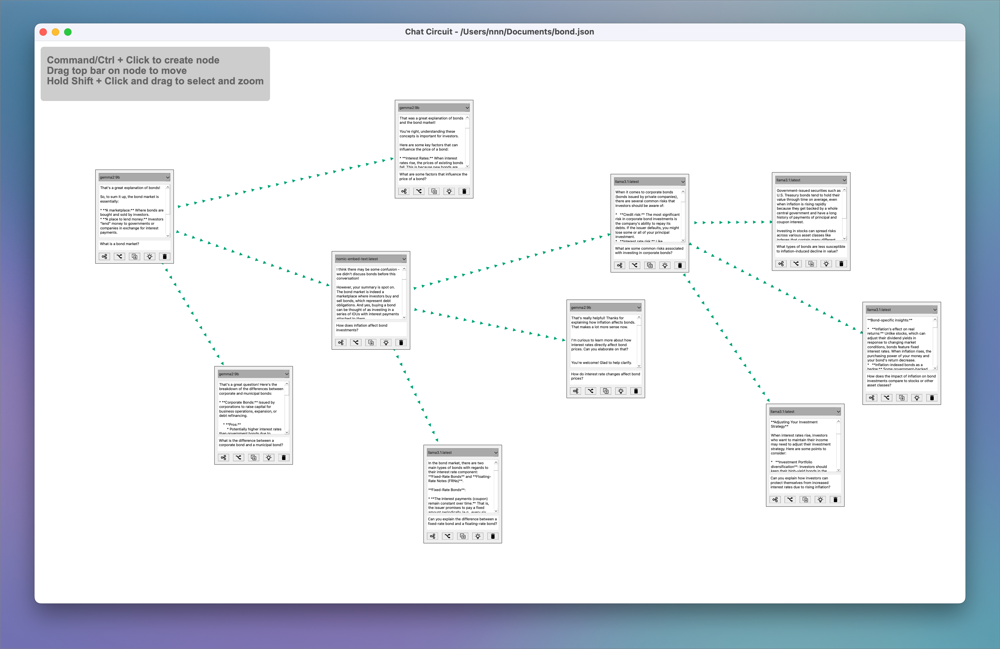

# Chat Circuit



**Brief overview**
<blockquote class="twitter-tweet" data-media-max-width="560"><p lang="en" dir="ltr">🔍 Added a small feature to zoom in using mouse selection. Handy for looking at deep branches <a href="https://twitter.com/hashtag/ChatCircuit?src=hash&amp;ref_src=twsrc%5Etfw">#ChatCircuit</a><br><br>👉 <a href="https://t.co/y20u9vZevM">https://t.co/y20u9vZevM</a> <a href="https://t.co/noONyJBvw2">pic.twitter.com/noONyJBvw2</a></p>&mdash; namuaN (@namuan_twt) <a href="https://twitter.com/namuan_twt/status/1826620308507558383?ref_src=twsrc%5Etfw">August 22, 2024</a></blockquote>

### Short demos

**Re-run all nodes in a branch**
<blockquote class="twitter-tweet" data-media-max-width="560"><p lang="en" dir="ltr">Chat Circuit now makes it possible to re-run a branch of your conversation with LLM with a different prompt. It supports all local LLMs running on <a href="https://twitter.com/ollama?ref_src=twsrc%5Etfw">@ollama</a> <br>💾 👉 <a href="https://t.co/y20u9vYGGe">https://t.co/y20u9vYGGe</a> <a href="https://t.co/ib7OTWhnwW">pic.twitter.com/ib7OTWhnwW</a></p>&mdash; namuaN (@namuan_twt) <a href="https://twitter.com/namuan_twt/status/1820796082248458377?ref_src=twsrc%5Etfw">August 6, 2024</a></blockquote>

**Generate Follow up questions**
<blockquote class="twitter-tweet" data-media-max-width="560"><p lang="en" dir="ltr">Implemented this idea in chat circuit. Here is a quick demo of the application along with generating follow up questions using <a href="https://twitter.com/hashtag/LLM?src=hash&amp;ref_src=twsrc%5Etfw">#LLM</a> <a href="https://t.co/y20u9vYGGe">https://t.co/y20u9vYGGe</a> <a href="https://t.co/2rFxBIZyg5">https://t.co/2rFxBIZyg5</a> <a href="https://t.co/IjnXu0si35">pic.twitter.com/IjnXu0si35</a></p>&mdash; namuaN (@namuan_twt) <a href="https://twitter.com/namuan_twt/status/1825849039348289574?ref_src=twsrc%5Etfw">August 20, 2024</a></blockquote>

**Zoom in/out**
<blockquote class="twitter-tweet" data-media-max-width="560"><p lang="en" dir="ltr">🔍 Added a small feature to zoom in using mouse selection. Handy for looking at deep branches <a href="https://twitter.com/hashtag/ChatCircuit?src=hash&amp;ref_src=twsrc%5Etfw">#ChatCircuit</a><br><br>👉 <a href="https://t.co/y20u9vZevM">https://t.co/y20u9vZevM</a> <a href="https://t.co/noONyJBvw2">pic.twitter.com/noONyJBvw2</a></p>&mdash; namuaN (@namuan_twt) <a href="https://twitter.com/namuan_twt/status/1826620308507558383?ref_src=twsrc%5Etfw">August 22, 2024</a></blockquote>

### Features

**Multi-Branch Conversations**
Create and manage multiple conversation branches seamlessly.

**Contextual Forking**
Fork conversation branches with accurate context retention.

### Editor Features

**Save and Load Diagrams**

**Undo and Redo**

**Zoom and Pan**


**Re-run nodes in a branch**

It is possible to re-run all the nodes in a branch after changing the prompt it any node in the list.


### Running the Application

To run this application, follow these steps:

**Generate models configuration file**

```shell
ollama list | tail -n +2 | awk '{print $1}' > models.conf
```

**Install dependencies**

```shell
python3 -m pip install -r requirements.txt
```

**Run application**
```shell
python3 main.py
```

### Model Configuration

The LLM models available are loaded from `models.conf` in the current directory
See `models.conf.example`

The default model is the first one in that list

You can also run this command to generate the `models.conf` file

```shell
ollama list | tail -n +2 | awk '{print $1}' > models.conf
```

Note: If models.conf is not found, the application will use a default set of models.
